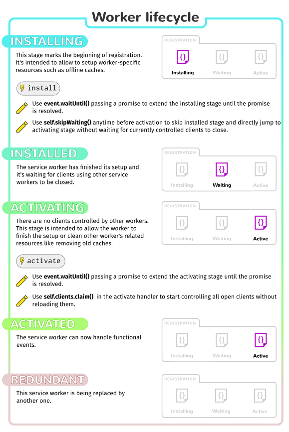

# Service workers

Service workers are a type of worker that serve the explicit purpose of being a proxy between the browser and the network and/or cache.

## Service workers vs Web workers

> So Web Workers are handy to run expensive scripts without causing the user interface to freeze, while Service Workers are useful to modify the response from network requests (for example, when building an offline app).

## Usages

- Offline support
- Caching
- Push notification

## Limitations

- Can't access DOM directly. Communicate via the postMessage interface
- HTTPS only

## Life Cycle

## References

- https://medium.com/@vipulnema2610/understanding-service-worker-life-cycle-b6580aa4eb50